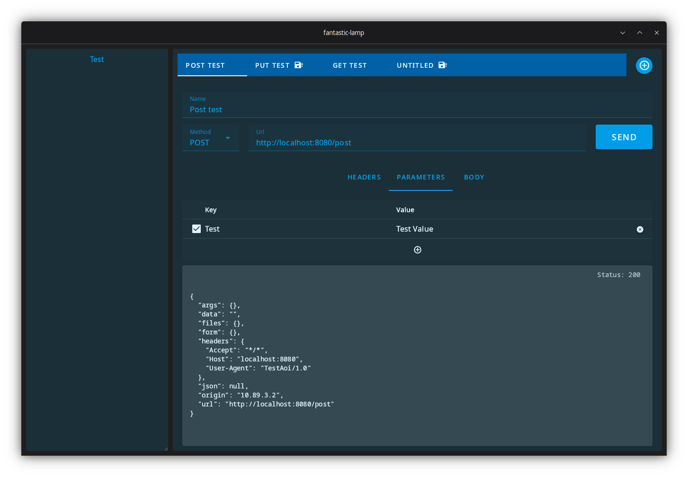

# API Tester

A small program that can send GET, POST, PUT, DELETE requests to addresses with given parameters.

## Tech
- Rust
- Tauri
- Vue + Vuetify
- SQlite

## Backend for testing the program

- Start httpbin container from /test
- The API test server starts in port 8080

